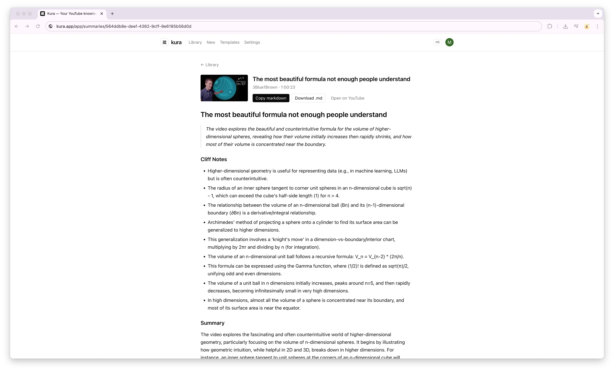

# Kura

> 蔵 — a traditional Japanese storehouse. Kura is a storehouse for knowledge extracted from YouTube.

<p align="center">
  <picture>
    <source media="(prefers-color-scheme: dark)" srcset="public/marketing/hero-dark.webp">
    
  </picture>
</p>

<p align="center">
  <a href="https://kura-md.com"><strong>Live demo →</strong></a>
  &nbsp;·&nbsp;
  <a href="./CLAUDE.md">Architecture</a>
  &nbsp;·&nbsp;
  <a href="./CONTRIBUTING.md">Contributing</a>
  &nbsp;·&nbsp;
  <a href="https://github.com/zhashkevych/kura/issues">Issues</a>
</p>

Paste a YouTube URL → get a structured Markdown note for your Obsidian vault or
Notion database. Kura runs the transcript through Gemini against a Handlebars
template, gives you back a `.md` file that drops cleanly into your existing
notes.

Kura is open source under MIT. This repo is the entire app — fork it,
self-host it, change the templates, change the model. There's no billing,
no paid tier, and no usage limit beyond whatever your LLM provider charges.

## Stack

- Next.js 15 (App Router, Server Actions, `after()`)
- TypeScript strict
- Tailwind 4 + shadcn-style primitives
- Clerk for auth
- Neon Postgres + Drizzle ORM
- Supadata for transcripts
- Gemini 2.5 Flash for structured output
- Handlebars for Markdown templates

## Self-host

You'll need accounts on four free-tier services. The whole setup takes about
ten minutes.

1. **Install dependencies**

   ```bash
   npm install
   ```

2. **Provision external services**

   - [Neon](https://neon.tech) — create a project, copy the pooled connection string.
   - [Clerk](https://clerk.com) — create an application, grab the publishable + secret keys.
     For production, also create a webhook pointing at
     `https://<your-domain>/api/webhooks/clerk` listening for `user.created`,
     `user.updated`, `user.deleted` and copy the signing secret. Local dev
     works without the webhook — users are lazily provisioned on first request.
   - [Supadata](https://supadata.ai) — API key for transcript fetching.
   - [Google AI Studio](https://aistudio.google.com) — API key for Gemini.

3. **Configure environment**

   ```bash
   cp .env.example .env.local
   # fill in every value
   ```

4. **Run migrations + seed**

   ```bash
   npm run db:push      # applies the Drizzle schema to Neon
   npm run db:seed      # inserts the 3 system templates
   ```

5. **Dev server**

   ```bash
   npm run dev
   ```

   Visit http://localhost:3000.

## Smoke tests

With a live `.env.local`:

```bash
# verify DB connectivity
curl -s localhost:3000/api/health | jq

# fetch a transcript without touching the DB or LLM
npx tsx scripts/test-transcript.ts "https://www.youtube.com/watch?v=dQw4w9WgXcQ"

# end-to-end pipeline to the LLM (costs a few tokens)
npx tsx scripts/test-summary.ts "https://www.youtube.com/watch?v=dQw4w9WgXcQ"
```

## Architecture

See [`CLAUDE.md`](./CLAUDE.md) for the full architecture: request flow, the
LLM contract and its three-schema lockstep, the auth/database setup, and the
gotchas you should know before changing anything.

A 30-second version: `POST /api/summaries` validates the URL and inserts a
pending row, then schedules the heavy work via Next's `after()`. The worker
fetches the transcript, calls Gemini with a constrained JSON schema, validates
with Zod (with a repair-retry ladder), and writes the result. The client polls
for completion and renders the Markdown via the template's Handlebars source.

## Deploying to Vercel

1. Push your fork to GitHub and import it in Vercel.
2. Set every variable from `.env.example` in the project settings.
3. Enable **Fluid Compute** so `after()` background work has time to finish —
   this is non-optional. Without it, summaries will silently truncate.
4. Point your Clerk webhook at the production URL.
5. Run `npm run db:push && npm run db:seed` from your workstation against the
   production `DATABASE_URL` once on first deploy.
6. Tune rate limits if your deployment needs it. `POST /api/summaries` and
   `POST /api/summaries/[id]/retry` are limited per authenticated user by
   `SUMMARY_RATE_LIMIT_HOUR` (default 5) and `SUMMARY_RATE_LIMIT_DAY` (default
   20). Raise them for private self-hosted deployments; lower them to cap
   LLM cost on a public instance.

## Roadmap and non-goals

The current open-source release is the MVP: paste a URL, get a Markdown note.
The following are deliberately not implemented and are signaled in the schema
but unwired in code — see `CONTRIBUTING.md` for direction before working on
any of them:

- Notion sync
- User-owned custom templates UI
- YouTube channel subscriptions / auto-ingest
- pgvector / semantic search

## Contributing

PRs welcome. Read [`CONTRIBUTING.md`](./CONTRIBUTING.md) for the dev loop,
commit conventions, and what's in vs out of scope.

For security issues, please follow [`SECURITY.md`](./SECURITY.md) instead of
filing a public issue.

## Testing

```bash
npm run typecheck
npm test
npm run build
```

CI runs all three on every PR.

## License

[MIT](./LICENSE) © 2026 Maksim Zhashkevych
